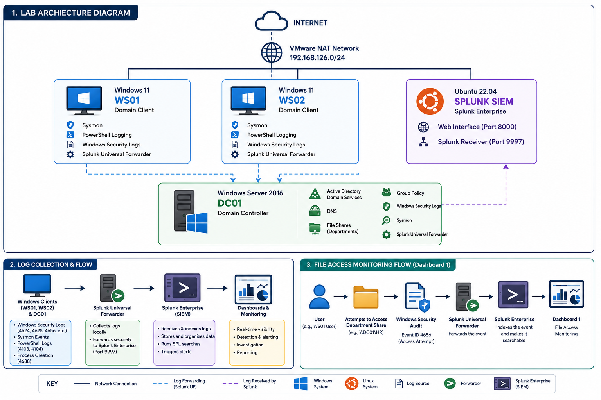

# Enterprise Security Monitoring Lab

A Windows-based security monitoring lab built using Active Directory, Group Policy, Sysmon, Windows Security Auditing, and Splunk Enterprise to simulate centralized monitoring within a small enterprise environment.

The project demonstrates how Windows endpoints can be monitored through centralized log collection, endpoint telemetry, and Active Directory security controls while providing visibility into authentication activity, PowerShell execution, process creation, and access to departmental file shares.

---

# Lab Architecture

The following diagram illustrates the complete lab architecture, including the VMware network, Active Directory environment, Windows endpoints, Splunk Enterprise SIEM, log collection workflow, and file access monitoring process.

---

# Technologies Used

| Category | Technologies |
|----------|--------------|
| Operating Systems | Windows Server 2016, Windows 11 Pro, Ubuntu Server 22.04, Kali Linux |
| Identity Management | Active Directory Domain Services |
| Security Monitoring | Splunk Enterprise, Splunk Universal Forwarder |
| Endpoint Telemetry | Sysmon |
| Windows Logging | Windows Security Auditing, PowerShell Logging |
| Administration | Group Policy, DNS, NTFS Permissions, Share Permissions |
| Virtualization | VMware Workstation |
| Documentation | Markdown |

---

# Key Components

- Active Directory Domain Services (AD DS)
- Organizational Units (OUs)
- Group Policy Objects (GPOs)
- Departmental File Shares
- NTFS & Share Permissions
- Windows Security Auditing
- PowerShell Logging
- Sysmon Endpoint Monitoring
- Splunk Universal Forwarders
- Splunk Enterprise SIEM
- Centralized Log Collection
- Windows Security Monitoring
- MITRE ATT&CK Mapping

---

# Splunk Dashboards

The project includes custom Splunk dashboards that provide centralized visibility into Active Directory authentication events and Windows security activity.

## Active Directory Security Monitoring

## Windows Security Monitoring

---

# Project Status

**Status:** ✅ Completed

This project successfully demonstrates the deployment of a Windows enterprise security monitoring environment using Active Directory, Group Policy, Sysmon, Windows Security Auditing, and Splunk Enterprise. It includes centralized log collection, endpoint monitoring, file access auditing, security event analysis, MITRE ATT&CK mapping, and comprehensive technical documentation covering the complete implementation process.