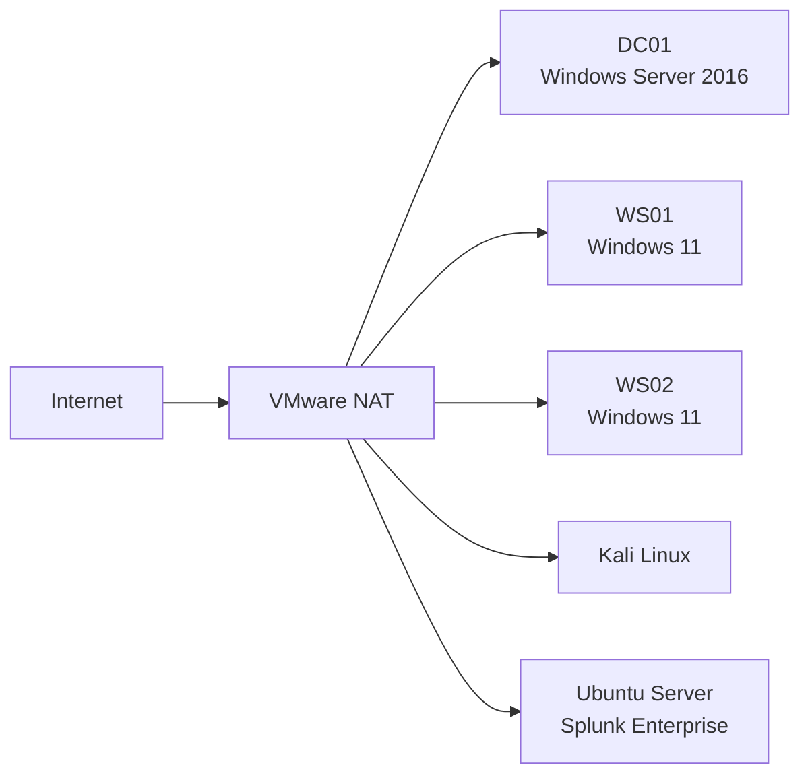

# 01 - Environment Setup

## 1. Project Overview

This project documents the design, deployment, monitoring, testing, and continuous improvement of a simulated enterprise environment for a fictional company named **NorthBridge Technologies**.

The objective is to build a realistic Windows enterprise environment that demonstrates secure infrastructure deployment, centralized management, security monitoring, detection engineering, and incident investigation, while providing a foundation for future attack simulation and detection validation.

The environment is hosted locally using VMware Workstation 17 Player.

---

## 2. Virtualization Platform

| Setting | Configuration |
|---|---|
| Hypervisor | VMware Workstation 17 Player |
| Host Operating System | Windows |
| Host Memory | 16 GB RAM |
| Virtual Network Mode | NAT |
| VMware Subnet | `192.168.126.0/24` |
| Subnet Mask | `255.255.255.0` |
| CIDR Prefix | `/24` |
| VMware NAT Gateway | `192.168.126.2` |
| Address Range | `192.168.126.1 - 192.168.126.254` |
| Broadcast Address | `192.168.126.255` |

The NAT network provides isolated communication between all virtual machines while allowing controlled internet access through the host system.

---

## 3. Virtual Machine Inventory

| Hostname | Operating System | Role | IP Address | Addressing |
|---|---|---|---|---|
| `DC01` | Windows Server 2016 | Active Directory Domain Controller | `192.168.126.10/24` | Static |
| `WS01` | Windows 11 | Employee Workstation | `192.168.126.20/24` | Static |
| `WS02` | Windows 11 | Employee Workstation | `192.168.126.21/24` | Static |
| `kali` | Kali Linux | Security Testing Workstation | `192.168.126.143/24` | DHCP |
| `splunk` | Ubuntu Server 22.04 LTS | SIEM Server | `192.168.126.144/24` | DHCP |

---

## 4. Network Addressing

### Network Summary

| Setting | Value |
|---|---|
| Network Address | `192.168.126.0` |
| Subnet Mask | `255.255.255.0` |
| CIDR | `/24` |
| Default Gateway | `192.168.126.2` |
| Broadcast Address | `192.168.126.255` |
| Total Addresses | 256 |
| Usable Addresses | 254 |

---

### IP Address Allocation

| IP Address | Device | Purpose |
|---|---|---|
| `192.168.126.2` | VMware NAT Gateway | Internet routing |
| `192.168.126.10` | DC01 | Active Directory & DNS |
| `192.168.126.20` | WS01 | Domain Workstation |
| `192.168.126.21` | WS02 | Domain Workstation |
| `192.168.126.143` | Kali Linux | Future Security Testing & Attack Simulation |
| `192.168.126.144` | Splunk Enterprise | Security Monitoring |

---

## 5. DNS Configuration

The Domain Controller provides DNS services for all Windows systems.

| Device | Preferred DNS Server |
|---|---|
| DC01 | `192.168.126.10` |
| WS01 | `192.168.126.10` |
| WS02 | `192.168.126.10` |

Using the Domain Controller as the primary DNS server allows Windows clients to locate domain resources, authenticate users, apply Group Policy, and resolve internal hostnames.

Kali Linux and the Splunk server currently receive DNS settings through VMware DHCP because they are not members of the Active Directory domain.

---

## 6. DHCP Configuration

VMware NAT provides DHCP services for non-domain systems within the virtual environment.

### DHCP Clients

- Kali Linux
- Ubuntu Server (Splunk)

### Static Addressing

Static IP addresses were assigned to the Windows infrastructure to ensure consistent communication between Active Directory, DNS, Group Policy, and security monitoring services.

Static devices include:

- DC01
- WS01
- WS02

---

## 7. Kali Linux

Kali Linux is included in the lab environment as a dedicated security testing workstation. While the current project focuses on Windows security monitoring and detection, the system has been prepared to support future attack simulation and detection validation scenarios.

| Setting | Value |
|---|---|
| Hostname | `kali` |
| Operating System | Kali Linux |
| IP Address | `192.168.126.143/24` |
| Addressing | DHCP |
| Network Mode | VMware NAT |

---

## 8. Environment Architecture

---

## 9. Outcome

A fully functional enterprise virtual environment was successfully deployed using VMware Workstation Player. The environment provides isolated networking, centralized Windows infrastructure, dedicated attack and monitoring systems, and a scalable foundation for security monitoring, detection engineering, and incident response throughout the remainder of the project.

---

## 10. Next Phase

The next stage focuses on deploying and configuring Active Directory Domain Services, organizational units, users, computers, and domain-joined Windows endpoints.