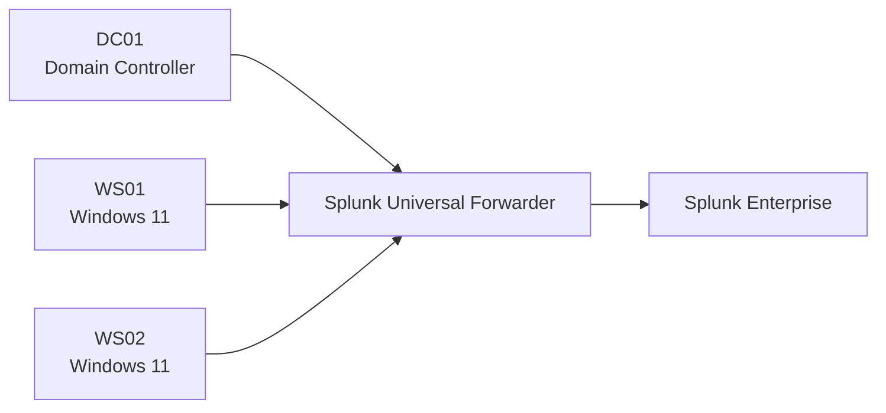

\# 01 - Environment Setup

\## 1. Project Overview

This project documents the design, deployment, monitoring, testing, and security improvement of a simulated enterprise environment for a fictional company named \*\*NorthBridge Technologies\*\*.

The environment was built to demonstrate how an organisation can:

\- Deploy and manage Active Directory infrastructure

\- Centralise security logs using Splunk Enterprise

\- Improve endpoint visibility using Sysmon

\- Simulate realistic internal and external cyber threats

\- Investigate security incidents

\- Map attacker activity to the MITRE ATT\&CK framework

\- Implement security improvements through Group Policy

\- Translate technical security findings into business risk and recommendations

The lab is hosted locally using VMware Workstation Player.

\---

\## 2. Virtualisation Platform

| Setting | Configuration |

|---|---|

| Hypervisor | VMware Workstation 17 Player |

| Host operating system | Windows |

| Host memory | 16 GB RAM |

| Virtual network mode | NAT |

| VMware subnet | `192.168.126.0/24` |

| Subnet mask | `255.255.255.0` |

| CIDR prefix | `/24` |

| VMware NAT gateway | `192.168.126.2` |

| Address range | `192.168.126.1` to `192.168.126.254` |

| Broadcast address | `192.168.126.255` |

The NAT configuration allows the virtual machines to communicate with each other and access the internet through the host computer while remaining separated from the physical local network.

\---

\## 3. Virtual Machine Inventory

| Hostname | Operating System | Role | IP Address | Addressing |

|---|---|---|---|---|

| `DC01` | Windows Server 2016 | Active Directory Domain Controller and DNS server | `192.168.126.10/24` | Static |

| `WS01` | Windows 11 | Domain-joined employee workstation | `192.168.126.20/24` | Static |

| `WS02` | Windows 11 | Second domain-joined employee workstation | `192.168.126.21/24` | Static |

| `kali` | Kali Linux | Internal attacker and security testing platform | `192.168.126.143/24` | DHCP |

| `splunk` | Ubuntu Server 22.04 LTS | Splunk Enterprise SIEM server | `192.168.126.144/24` | DHCP |

The DHCP-assigned addresses for Kali and Splunk may change after a reboot. They will later be converted to static addresses or reserved through VMware DHCP to provide consistent connectivity.

\---

\## 4. Network Addressing

\### 4.1 Network Summary

| Item | Value |

|---|---|

| Network address | `192.168.126.0` |

| CIDR notation | `/24` |

| Subnet mask | `255.255.255.0` |

| Default gateway | `192.168.126.2` |

| Broadcast address | `192.168.126.255` |

| Total addresses | 256 |

| Usable host addresses | 254 |

\### 4.2 IP Address Allocation

| IP Address | Device | Purpose |

|---|---|---|

| `192.168.126.2` | VMware NAT gateway | Routes virtual machine traffic to external networks |

| `192.168.126.10` | DC01 | Active Directory and DNS |

| `192.168.126.20` | WS01 | Employee workstation |

| `192.168.126.21` | WS02 | Second employee workstation |

| `192.168.126.143` | Kali | Attack simulation |

| `192.168.126.144` | Splunk | Central SIEM server |

\---

\## 5. DNS Configuration

The Domain Controller provides DNS services for the Windows domain.

| Device | Preferred DNS server |

|---|---|

| DC01 | `192.168.126.10` |

| WS01 | `192.168.126.10` |

| WS02 | `192.168.126.10` |

Using DC01 as the preferred DNS server allows WS01 and WS02 to:

\- Locate the Domain Controller

\- Resolve the Active Directory domain

\- Authenticate domain users

\- Apply Group Policy

\- Resolve internal hostnames

The Kali and Splunk systems currently receive their DNS configuration through VMware DHCP because they are not joined to the Windows domain.

\---

\## 6. DHCP Configuration

VMware provides DHCP services on the NAT network.

DHCP is currently used by:

\- Kali Linux

\- Ubuntu Server hosting Splunk

Static addressing is used for:

\- DC01

\- WS01

\- WS02

Static addressing was selected for the Windows infrastructure because Active Directory, DNS, log forwarding, and SIEM communication require stable and predictable addresses.

\---

\## 7. Active Directory Configuration

| Setting | Value |

|---|---|

| Fictional organisation | NorthBridge Technologies |

| Active Directory domain | `corp.northbridge.com` |

| NetBIOS domain name | `CORP` |

| Domain Controller | `DC01` |

| DNS server | `DC01` |

| DNS server address | `192.168.126.10` |

The Active Directory environment contains organisational units representing business departments and infrastructure categories.

Configured organisational units include:

\- Executive

\- Finance

\- Human Resources

\- Information Technology

\- Marketing

\- Operations

\- Sales

\- Servers

\- Service Accounts

\- Workstations

\- Groups

Employee user accounts and security groups were created to simulate a realistic company structure.

\---

\## 8. Workstation Deployment

\### WS01

WS01 was installed as a Windows 11 virtual machine and configured with:

\- Hostname: `WS01`

\- Static IP: `192.168.126.20`

\- Preferred DNS: `192.168.126.10`

\- Domain membership: `corp.northbridge.com`

\- Computer account location: Workstations OU

WS01 is used as the main employee workstation and represents the initial endpoint for several planned security scenarios.

\### WS02

WS02 was created by copying the WS01 virtual machine.

After cloning, the following changes were made:

\- The computer was renamed from WS01 to WS02

\- The IP address was changed to `192.168.126.21`

\- The workstation trust relationship was repaired

\- A separate Active Directory computer account was created

\- The computer object was placed in the Workstations OU

WS02 provides a second enterprise endpoint for lateral movement, authentication monitoring, and multi-host investigations.

\---

\## 9. Kali Linux Deployment

Kali Linux is used as the controlled attack simulation platform.

| Setting | Value |

|---|---|

| Hostname | `kali` |

| IP address | `192.168.126.143/24` |

| Network mode | VMware NAT |

| Addressing | DHCP |

| Purpose | Internal security testing and attack simulation |

Kali is not joined to the Active Directory domain.

It will be used only within the isolated lab environment to simulate authorised security scenarios such as:

\- Network reconnaissance

\- Authentication attacks

\- Internal threat activity

\- Suspicious remote connections

\- Lateral movement attempts

\---

\## 10. Splunk Server Deployment

Splunk Enterprise is installed on a dedicated Ubuntu Server virtual machine.

| Setting | Value |

|---|---|

| Hostname | `splunk` |

| Operating system | Ubuntu Server 22.04 LTS |

| IP address | `192.168.126.144/24` |

| Addressing | DHCP |

| Splunk version | 10.4.1 |

| Web interface | `http://192.168.126.144:8000` |

| Installation package | Linux AMD64 `.deb` |

| Installation directory | `/opt/splunk` |

The Splunk server provides centralised security event collection, searching, dashboards, alerting, and investigation capabilities.

\---

\## 11. Endpoint Monitoring

Sysmon has been installed on:

\- DC01

\- WS01

\- WS02

The SwiftOnSecurity Sysmon configuration was used to increase visibility into Windows activity.

Sysmon monitoring includes:

\- Process creation

\- Process termination

\- DNS queries

\- Network connections

\- Registry activity

\- File creation

\- Driver and image loading

\- Other endpoint activity

The Sysmon Operational log was verified through Windows Event Viewer.

\---

## 12. Current Logging Architecture

